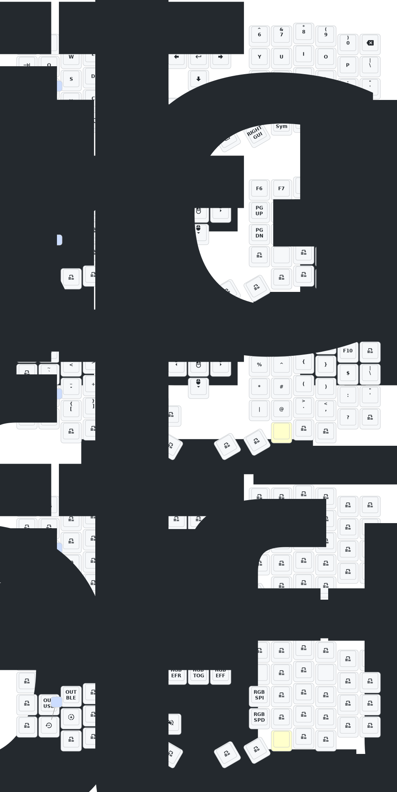

# Sofle v2 low-profile Wireless Mechanical Keyboard

## Documentation

- [ZMK Firmware](https://zmk.dev/docs)

## Keymap Configuration

- [ZMK Keymap Editor](https://nickcoutsos.github.io/keymap-editor/) - An easy-to-use GUI for configuring your keymap online.

## Building and Flashing

All changes pushed to the repository trigger a build in GitHub Actions. To download the latest firmware:

1. Go to the [Actions tab](https://github.com/UgRoss/zmk-sofle/actions/workflows/build.yml) and select the **"Build ZMK firmware"** workflow.
2. Select the most recent successful run.
3. Scroll down to the **Artifacts** section at the bottom of the page.
4. Click on the `firmware` file to download the zip.

Extract the downloaded `.zip` file. You will find:

- A settings reset firmware (to reset keyboard settings if needed).
- The left and right keyboard firmwares in `.bin` or `.uf2` format.

### Flashing Instructions

- **Reset**: Press the switch inside the circular hole on the back of the keyboard once to reset.
- **Bootloader Mode (Flashing)**: Double-click the reset switch to enter **Bootloader** state. A new drive will appear on your computer.

1. Once in Bootloader mode, copy the corresponding `.bin` or `.uf2` file to the drive to flash the keyboard. Repeat for both sides.
2. Ensure the toggle switches on both sides are turned to the outer side (battery switch).

If you are only changing the keymap or settings, flashing only the left side is usually sufficient.

## Update List

- 2024/12/21
  1. Added support for zmk-studio (just refresh the left hand to use).
- 2024/10/24
  1. Modified power supply mode to reduce power consumption.
  2. Fixed the automatic shut-off feature for RGB power supply.
- 2025/8/22
  1. update the soft off.When you press the keys Q, S and Z simultaneously and hold them for 2 seconds, the keyboard will enter a deep sleep state and cannot be awakened by pressing the keys. This function can be used when carrying it outside. The activation method is to press the reset switch once.
  2. This month, I also updated the ultra-thin versions of the corne and sofle cases. The frame and base plate have been thickened, and the opening of the reset switch has been adjusted, so that the reset switch can be easily pressed. At present, we are still conceptualizing how to design the shell with an inclined bracket.If you have carefully examined a PCB, you will notice that there are reserved interfaces for expansion IO. I wonder if anyone has been able to utilize them,I will try it！
  3. The GIF animations on the right-hand keyboard screen have been removed, which will significantly reduce the power consumption of the right-hand keyboard.

> If your sofle was updated before 2025/8/22, please update to the latest firmware.

## Contact Me

For 3D printed model files or any issues and malfunctions with the keyboard, please contact [380465425@qq.com](mailto:380465425@qq.com)

## Sofle Keymap

